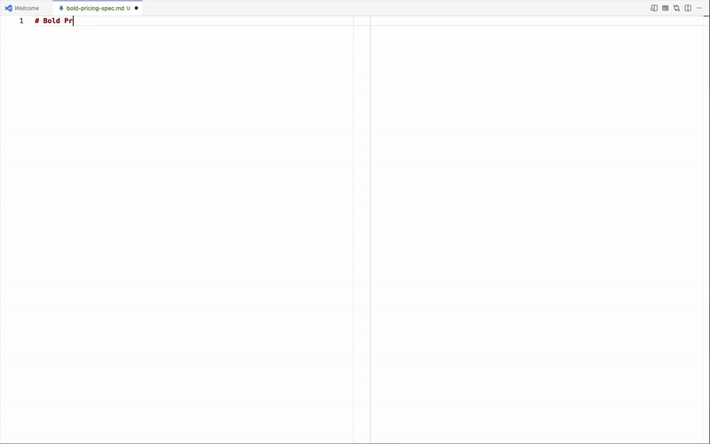

# Reactive MD

**Literate UI/UX for product teams.**

## The Idea

> *"Instead of imagining that our main task is to instruct a computer what to do, let us concentrate rather on explaining to human beings what we want a computer to do."*
> — Donald Knuth, *Literate Programming* (1984)

Knuth's insight was simple but radical: programs should be written for people first, machines second. This idea gave us Jupyter Notebooks for data science and Org mode for Emacs wizards.

**Reactive MD brings literate programming to UI/UX.**

Write product specs, wireframes, and user journeys with embedded, interactive React components. Unlike static mockups or separate prototyping tools, these documents let you **tell a story with working visuals** — prose and prototypes in one scrollable narrative.

<figure>
  
  <figcaption style="text-align: center"><b>Ideate, visualize, and collaborate all in one place</b></figcaption>
</figure>

## Quick Links

- 📦 [VS Code Marketplace](https://marketplace.visualstudio.com/items?itemName=million-views.reactive-md)
- 🐛 [Report Issues](https://github.com/million-views/reactive-md/issues)

## ✨ Key Features

| Feature | Description |
|---------|-------------|
| ⚡ **Live Reload** | See changes as you type — no manual refresh |
| 📝 **Markdown Fences** | `jsx live` renders inline in markdown preview |
| 📱 **Device Emulation** | Test responsive designs with a synchronized "Document Bus" |
| 🎨 **Tailwind v4** | Full utility support, zero config |
| 📦 **npm Packages** | Pre-bundled high-quality libraries (offline-first) |
| 🔍 **CodeLens** | Click "▶ Preview" above exported components |
| ⚛️ **React 19** | Modern runtime for high-fidelity interactive previews |
| 🎯 **TypeScript** | Full `.tsx` support with type stripping |

## Installation

Requires **VS Code 1.106.0+**. No internet connection required (100% offline support).

1. Open VS Code
2. Press `Cmd+Shift+X` (Mac) or `Ctrl+Shift+X` (Windows/Linux)
3. Search for "Reactive MD"
4. Click Install

Or install from the command line:
```bash
code --install-extension million-views.reactive-md
```

## 🚀 Quick Start

### Option 1: JSX/TSX Files
1. Open any `.jsx` or `.tsx` file
2. Press `Cmd+K P` (Mac) / `Ctrl+K P` (Windows/Linux)
3. Start coding — preview updates live!

### Option 2: Markdown Code Fences
~~~markdown
```jsx live
function Hello() {
  return <h1 className="text-2xl font-bold text-blue-600">Hello World!</h1>;
}
```
~~~

## 🎯 Two Preview Modes

| Mode | Keyboard | Best For |
|------|----------|----------|
| **Markdown Preview** | `Cmd+Shift+V` | Documentation, static examples, fast review |
| **Interactive Preview** | `Cmd+K P` | Hooks, state, animations, responsive testing |

**Markdown Preview** renders server-side HTML (hooks show initial state).
**Interactive Preview** runs full React runtime with live reload and pre-bundled libraries.

## 📦 Works With Your Favorite Libraries

```jsx live
import { motion } from 'motion/react';
import { Heart } from 'lucide-react';
import dayjs from 'dayjs';

function Demo() {
  return (
    <motion.div
      initial={{ scale: 0.9 }}
      animate={{ scale: 1 }}
      className="flex items-center gap-2 p-4"
    >
      <Heart className="text-red-500" />
      <span>Built with love • {dayjs().format('MMMM D, YYYY')}</span>
    </motion.div>
  );
}
```

## 📦 Bundled Libraries

Reactive MD is designed to work **100% offline**. The following libraries are pre-bundled directly into the extension:

`lucide-react`, `motion/react`, `clsx`, `dayjs`, `uuid`, `es-toolkit`, `zustand`, `jotai`, `react-hook-form`, `@heroicons/react`, `tailwind-merge`, `class-variance-authority`.

## Agent Skills

AI agents can work more effectively with Reactive MD using available skills:

- **reactive-md skill** — Specialized in creating functional markdown documents with embedded interactive React components for product specs, wireframes, and prototypes
- **elementary skill** — Token-based design system expertise for themeable interfaces and design system compliance (includes Wireframe/Elementary themes and optional components)

Both skills are available at [github.com/million-views/skills](https://github.com/million-views/skills) and provide domain-specific patterns, examples, and guardrails for working with this tool.

## Configuration

### Extension Settings

- **`reactiveMd.debounceMs`** (default: 300ms): Controls live reload delay. Increase if updates feel too frequent.
- **`reactiveMd.showCodeLens`** (default: true): Shows "▶ Preview" buttons above exported components.
- **`reactiveMd.previewOverlay`** (default: "full"): Controls error card display ("full", "minimal", or "none").
- **`reactiveMd.updateMode`** (default: "live"): Choose "live" for real-time updates or "on-save" for updates only when files are saved.

Access settings via `Cmd+,` (Mac) or `Ctrl+,` (Windows/Linux) and search for "Reactive MD".

## Recipes

The [recipes/](./recipes/) folder contains **examples** of what's possible with Reactive MD — from simple components to self-contained project folders with local imports.
  1. Open any `.md` file in VS Code with Reactive MD installed
  2. Use `Cmd+K P` (Mac) or `Ctrl+K P` (Windows/Linux) to open Interactive Preview
  3. Modify the JSX in code fences to customize examples
  4. See changes instantly - no build step required

Recipes use **Elementary design system** (with Wireframe or Elementary themes) or **Tailwind CSS** depending on the use case. See [recipes/design-systems/README.md](./recipes/design-systems/README.md) for the complete styling guide.

## License

MIT © [Million Views](https://m5nv.com)
